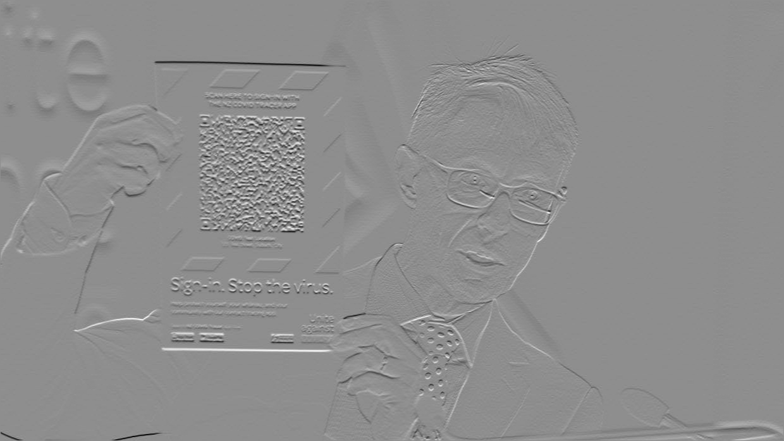

# QR code detection
### step 1 - greyscale ###

### step 2 - horizontal edges ###

### step 3 - vertical edges ###

### step 4 - edge image ###

### step 5 - mean smoothing ###

### step 6 - thresholding ###

### step 7 - closing operation ###

### step 8 - component analysis (grassfire algorithm) ###

### step 9 - corner detection ###
